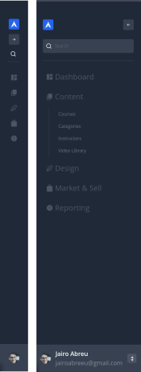

## Sidebar UnoCSS e Vite

Barra lateral funcional e dinâmica, passando por props o modelo do seu arquivo .json.

```ts
[
    {
        "icon": "ic:baseline-space-dashboard",
        "description": "Dashboard",
        "path": "/",
        "properties": []
    },
    {
        "icon": "material-symbols:content-copy-rounded",
        "description": "Content",
        "path": "/",
        "properties": [
           {
                "description": "Courses",
                "path": "/"
            },
            {
                "description": "Categories",
                "path": "/"
            }
         ]
      }
]
```

Com isso você terá sua barra lateral dessa forma.



Observe no json a propriedade icon:
Junto ao [UnoCSS](https://github.com/unocss/unocss) temos o poder de utilizar os ícones como uma classe, tudo graças a base de ícones [Iconify](https://iconify.design/).

Esta em fase beta e falta alguns ajustes.

Seja bem-vindo para contribuir.
